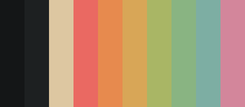

# Evergruv Material

A color theme based on and combining [@sainnhe](https://github.com/sainnhe)'s [Gruvbox Material Dark](https://github.com/sainnhe/gruvbox-material) for the dark variant and [Everforest Light](https://github.com/sainnhe/everforest) for the light variant.

## Themes

### Dark

The dark theme is based on [Gruvbox Material Dark](https://github.com/sainnhe/gruvbox-material). To get the palette, [view it on Coolers](https://coolors.co/141617-1D2021-DDC7A1-EA6962-E78A4E-D8A657-A9B665-89B482-7DAEA3-D3869B).

### Light

The light theme is based on [Everforest Light](https://github.com/sainnhe/everforest). To get the palette, [view it on Coolers](https://coolors.co/F2EFDF-FFFBEF-5C6A72-F85552-F57D26-DFA000-8DA101-35A77C-3A94C5-DF69BA).
